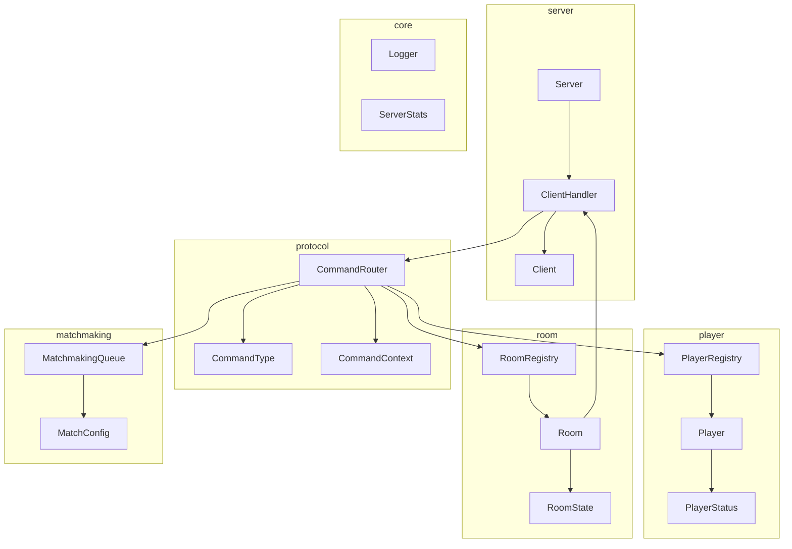
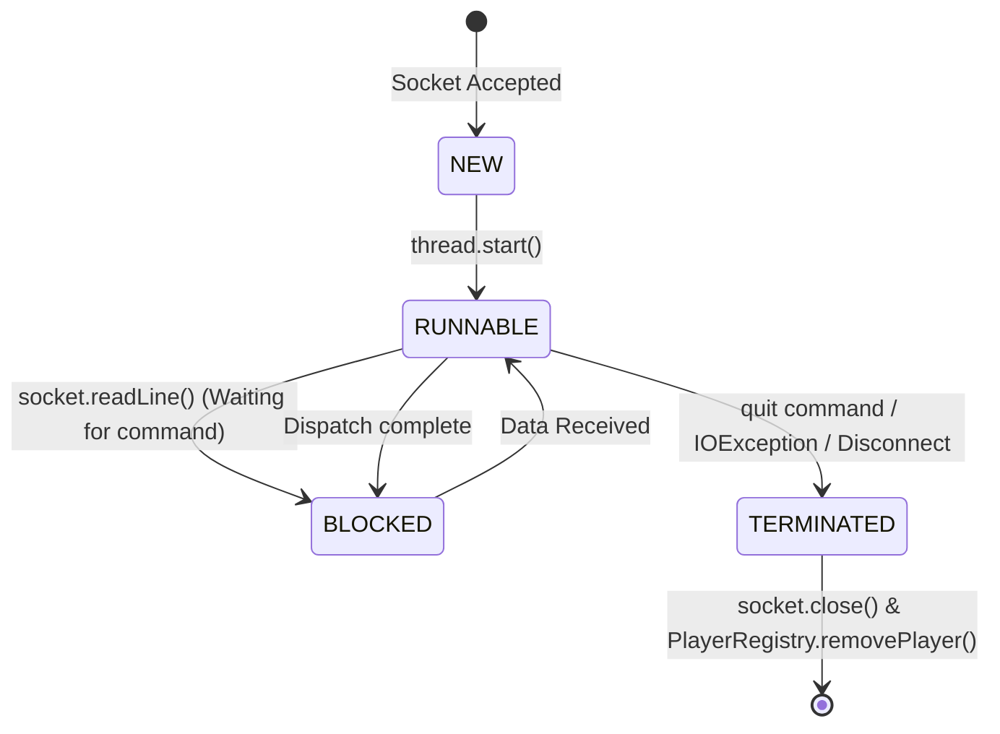
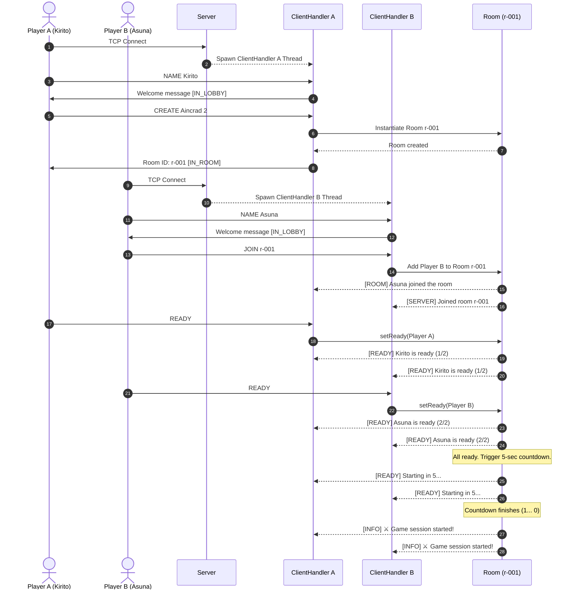
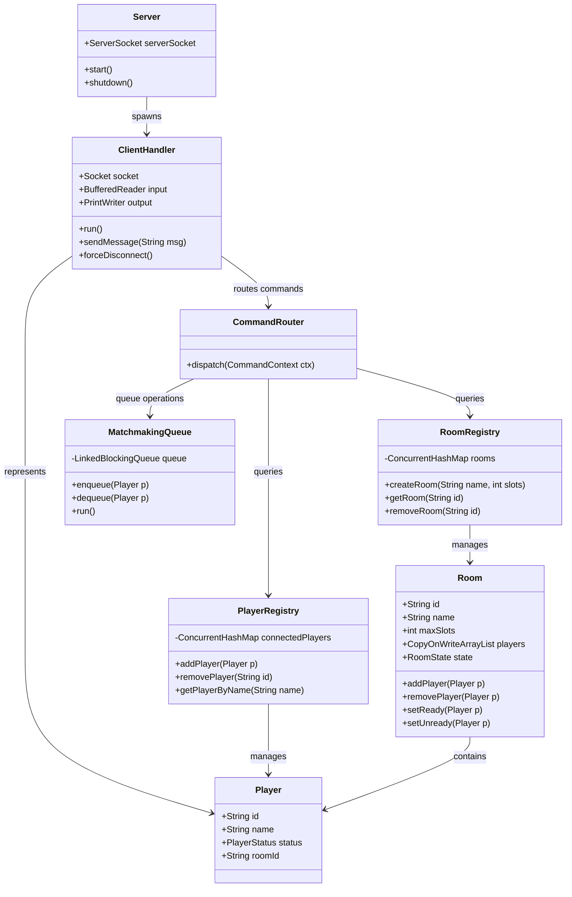
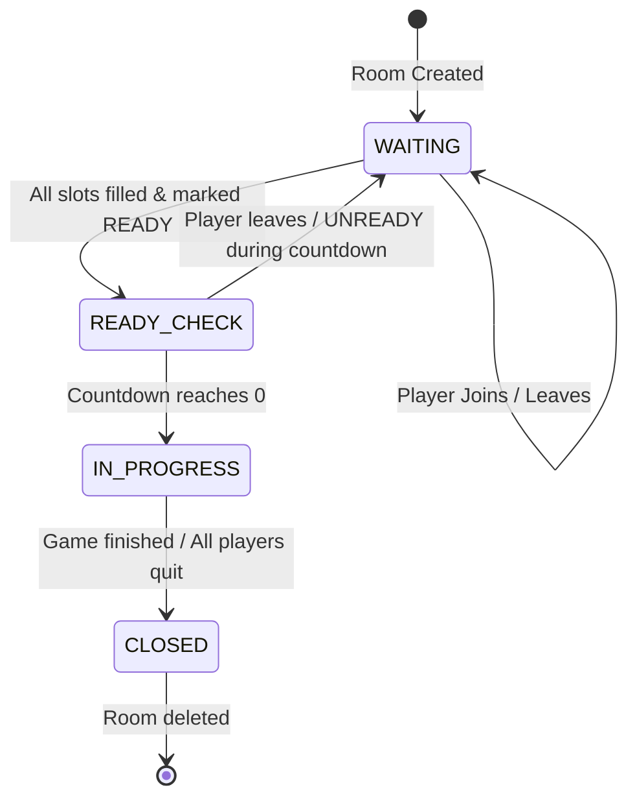
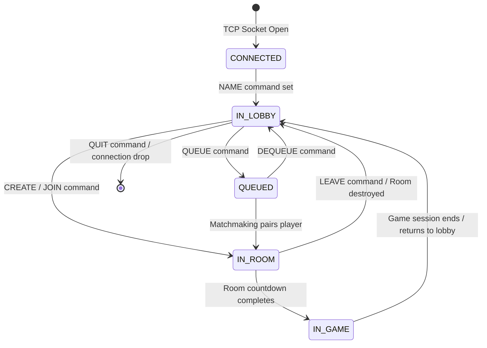
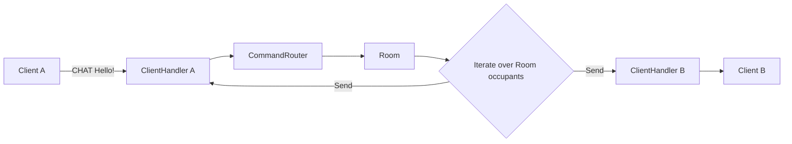

# AegisCore System Diagrams

This document contains visual representations of the **AegisCore** Game Lobby Server system architecture, lifecycle states, sequences, and data flows using Mermaid.

---

## 1. System Architecture

Shows the 6 packages of AegisCore and their relationship mappings:

---

## 2. Thread Lifecycle

Lifecycle transitions of a `ClientHandler` thread handling a single connection:

---

## 3. Connection & Game Startup Sequence

A complete flow showing two clients connecting, naming, creating/joining a room, going ready, and starting a game session:

---

## 4. Class Diagram

Class relationships, fields, and core methods:

---

## 5. Room State Machine

Lobby room state changes:

---

## 6. Player State Machine

Player status transitions:

---

## 7. Data Flow Broadcast Routing

How chat messages propagate from one client to all other occupants in the room:

